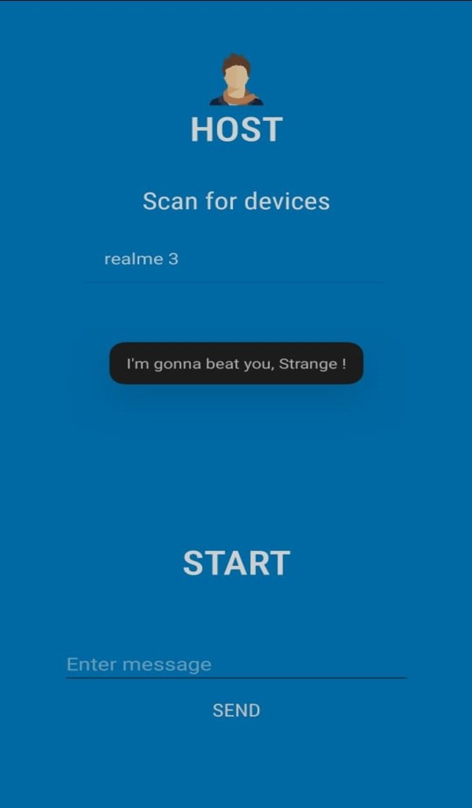
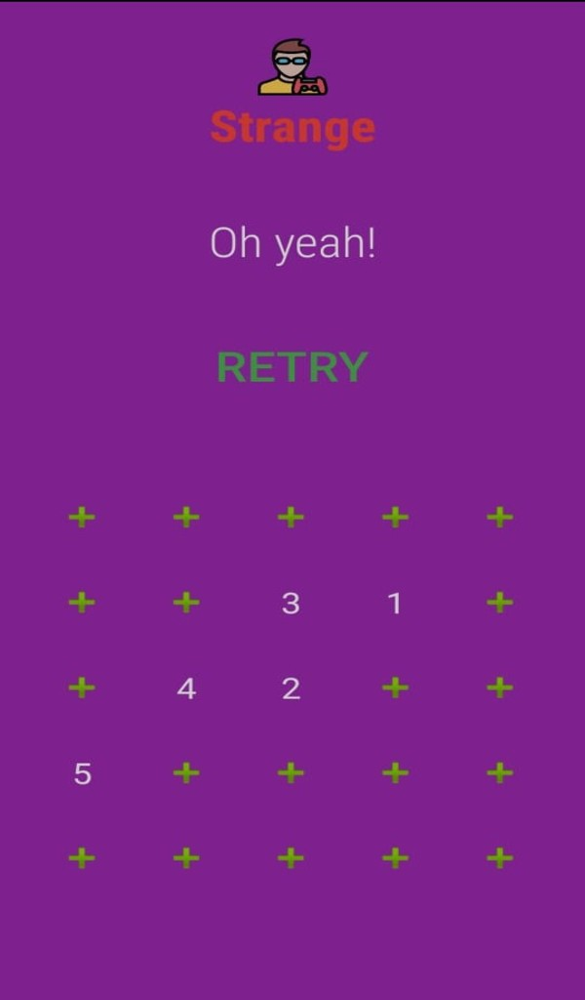
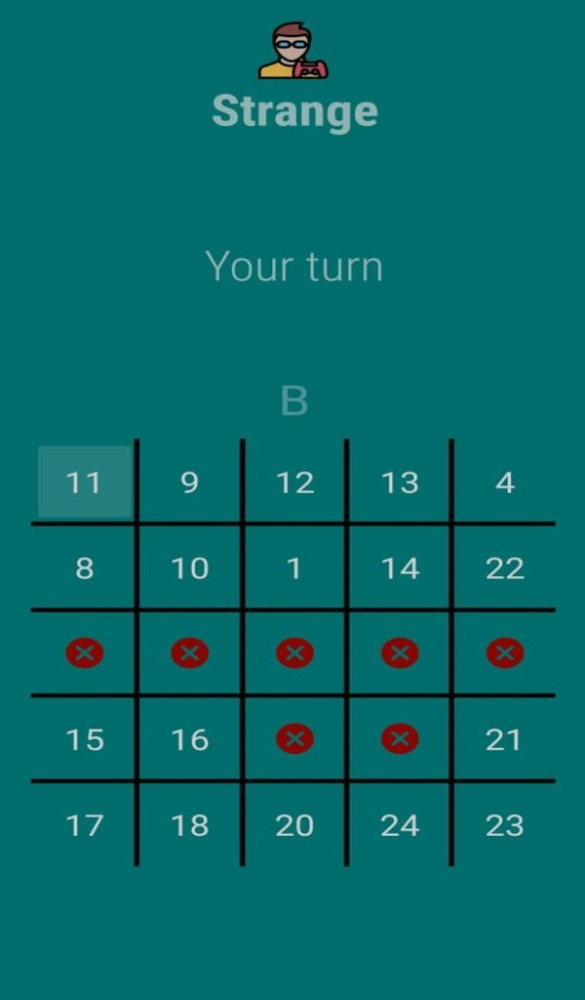
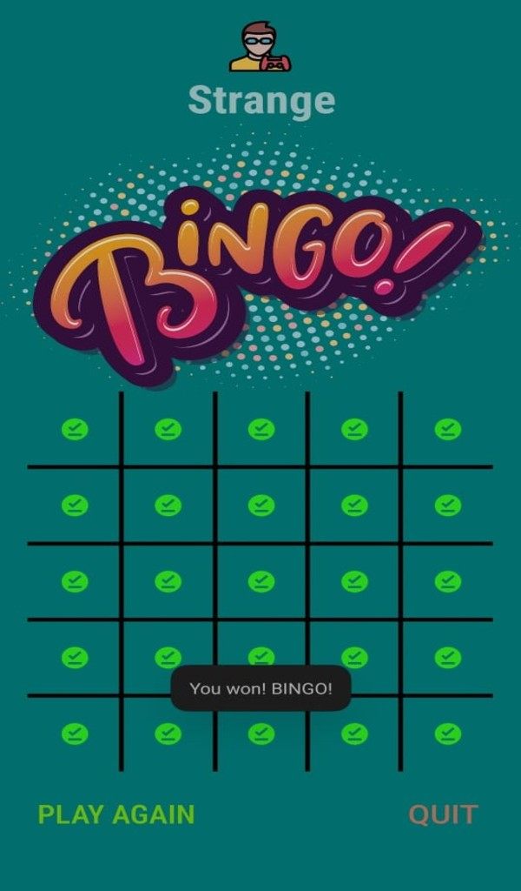

# BINGO 🎰

  

## Description
BINGO is a local-only multiplayer game which needs at least two devices to play.
The devices are connected using Wi-Fi P2P Direct automatically upon selection of devices.

## Rules
BINGO is played by two or more players where each player has a card of five rows and five columns each. 
Each player arranges the numbers from 1 - 25 on the 5x5 card randomly. When the game begins, one of the players call out a number which is struck off in all the players' cards. 
While the game continues, when a row, a column or a diagonal of cells are struck off, the respective player receives a point. 
The first player to reach 5 points win! Bingo!

## Features
- Local multiplayer
- Wi-Fi P2P Direct
- Card game
- Music

## Screenshots
  
  
  
  

## Download
Play BINGO for a fun card game experience with friends and family!

Download here 👇

https://www.amazon.com/gp/product/B093THT2VY

### Enjoy 😉✨
